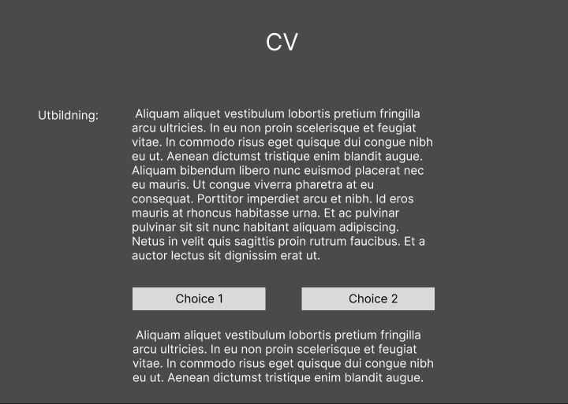

# CV-historia
### Målgrupp: 15-20 åringar

 Ide:  det ska var en interaktiv historia där man får gör val i viktiga delar av historian som kan ändra historians avslutning.

I det här exemplet så kommer man kunna göra val där utbildningen för hvudkaraktären Tim kan ändras.

  

vecka 36 \
onsdag: Jag hittade en bra grundkod för ett äventyrspel som jag använde som grund för att skapa mitt eget spel för CV äventyret. Nästa gång så tänker jag forsätta med historian och förbättra css på hemsidan.
